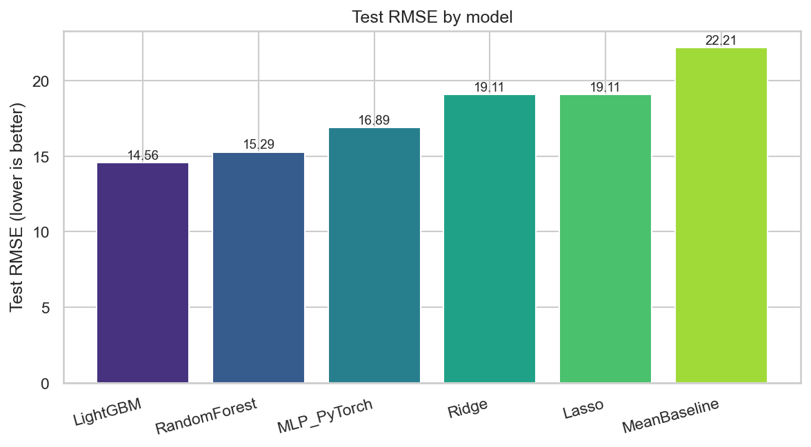

# Empirical Evaluation of Predictive Models for Audio-Feature-Based Track Popularity

Yale CPSC 5810 (Introduction to Machine Learning), final project.

We predict Spotify's `popularity` score (an integer 0–100 derived from
streaming counts, not from the audio) for ~114,000 tracks using only
audio features and a handful of low-cardinality categorical fields.
The goal is to characterize how much of `popularity` can be recovered
from audio alone, and to compare the cost-vs-accuracy trade-off across
six model families.

**Authors:** Guangxing Cao, Rena Wang, Xinyuan Zhu, and Leslie Wang.

## Headline results

All numbers below are on the held-out test set (15% of the data; never
touched during model selection). Reproduced from
[`outputs/tables/model_results.csv`](outputs/tables/model_results.csv).

| Model | RMSE | MAE | R² | ΔRMSE vs. mean baseline | Train (s) |
|---|---:|---:|---:|---:|---:|
| **LightGBM** (best) | **14.563** | **9.772** | **0.570** | **+34.4%** | 27.1 |
| Random Forest (tuned) | 15.289 | 10.768 | 0.526 | +31.2% | 76.5 |
| MLP (PyTorch, tuned)  | 16.894 | 11.326 | 0.421 | +23.9% | 66.0 |
| Ridge | 19.109 | 14.118 | 0.259 | +14.0% | 0.3 |
| Lasso | 19.109 | 14.108 | 0.259 | +14.0% | 1.7 |
| Mean baseline | 22.207 | 18.803 | −0.000 | 0.0% | <0.01 |

Both proposal targets (R² ≥ 0.50 AND ≥15% RMSE reduction over the mean
baseline) are met by **LightGBM** and **Random Forest**. The MLP clears
the RMSE bar but not the R² bar; the linear models clear neither. Full
write-up in [`reports/final_report.md`](reports/final_report.md).



## Repository layout

```
src/
  config.py              paths, seeds, feature lists
  data.py                load + clean + 70/15/15 split + preprocessor
  metrics.py             RMSE / MAE / R² wrappers
  eda.py                 exploratory plots + summary tables
  train_classical.py     mean baseline, Ridge, Lasso, RF (tuned), LightGBM
  train_nn.py            PyTorch MLP with validation sweep + early stopping
  ablation.py            refit LightGBM without `track_genre` (audio-only ceiling)
  multi_seed.py          refit RF / LightGBM / MLP under seeds [42, 7, 13]
  compare.py             comparison plots + final report writer
  _plotting.py           forces Agg backend before pyplot is imported
  run_all.py             end-to-end orchestrator (stages 1–6)

outputs/
  figures/               11 PNGs (5 EDA + learning curve + 4 comparisons + 1 hexbin)
  tables/                model_results.csv, rf_tuning.csv, mlp_tuning.csv,
                         multi_seed_results.csv, multi_seed_summary.csv,
                         ablation_genre.csv, feature_importances.csv,
                         feature_importances_grouped.csv, eda_summary.csv,
                         split_balance.csv, popularity_by_genre.csv, mlp_history.csv

reports/
  final_report.md        auto-generated; numbers come from the CSVs above

data/                    not in this repo (~20 MB Kaggle CSV; download below)
outputs/models/          not in this repo (~1.8 GB of trained model binaries;
                         regenerate with `python -m src.run_all`)
CPSC 5810 Project Proposal.pdf   the original course proposal
requirements.txt
.gitignore
```

## Setup

Tested on Windows 11 / macOS / Linux, Python 3.9–3.11. CUDA optional;
CPU-only works.

```bash
# Either clone the repo, or unzip the submission archive, then:
cd spotify-popularity-prediction
python -m pip install -r requirements.txt
```

## Get the dataset

The pipeline expects `data/spotify_tracks.csv`. The dataset itself is
not in the repo (it's distributed by Kaggle / HuggingFace; the README
points to the canonical source so anyone can grab the same file).

**Option A — HuggingFace mirror (no Kaggle account needed; recommended):**

```bash
mkdir -p data
python -c "from datasets import load_dataset; \
  load_dataset('maharshipandya/spotify-tracks-dataset', split='train') \
    .to_csv('data/spotify_tracks.csv', index=False)"
```

**Option B — Kaggle CLI:**

```bash
# requires kaggle.json with API credentials
kaggle datasets download -d maharshipandya/-spotify-tracks-dataset -p data --unzip
mv data/dataset.csv data/spotify_tracks.csv
```

## Reproduce every result

```bash
python -m src.run_all
```

This runs the six pipeline stages in order: EDA → classical models →
PyTorch MLP → genre ablation → multi-seed stability → comparison plots
and report. It regenerates every figure in `outputs/figures/`, every
metric CSV in `outputs/tables/`, and rewrites
`reports/final_report.md` with the actual numbers (no placeholders).

Wall-clock on a machine with one CUDA-capable GPU: ~9 minutes
(RF sweep dominates at ~5 min, LightGBM ~10 s, MLP sweep ~2 min,
multi-seed refits ~2 min). On CPU only, ~12 min.

The pipeline forces the Matplotlib `Agg` backend internally, so no
display server or Tk is required.

### Run individual stages

```bash
python -m src.eda                # EDA + figures 01–05 + split_balance.csv
python -m src.train_classical    # writes model_results.csv (baselines + classical)
python -m src.train_nn           # appends MLP row + writes learning curve
python -m src.ablation           # writes ablation_genre.csv
python -m src.multi_seed         # writes multi_seed_results.csv + summary
python -m src.compare            # comparison plots + final report
```

**macOS note:** if `python -m src.multi_seed` runs at full CPU briefly and
then sits at 0% CPU forever, it has hit an OpenMP thread-pool deadlock
between PyTorch and LightGBM (both ship their own OpenMP runtime, and on
some macOS + Anaconda setups they oversubscribe and lock up). Workaround:

```bash
KMP_DUPLICATE_LIB_OK=TRUE OMP_NUM_THREADS=1 python -m src.multi_seed
```

The single-threaded fallback adds a few minutes but always completes.
Linux and Colab are unaffected.

## Reproducibility

All randomness is seeded (`SEED=42`) across NumPy, Python `random`,
PyTorch CPU + CUDA, and the DataLoader generator. cuDNN is forced into
deterministic mode in `src/train_nn.py`. Two consecutive
`python -m src.run_all` runs produce **bit-identical** metrics across
every model (verified: max RMSE / R² drift across runs is exactly 0).

Methodological notes:

- The preprocessor (`StandardScaler` + `OneHotEncoder`) is fit only on
  the training split.
- Hyperparameters are tuned on the validation split (Ridge / Lasso
  `alpha` grid, RF 6-config grid in
  [`outputs/tables/rf_tuning.csv`](outputs/tables/rf_tuning.csv),
  LightGBM early-stopping point, MLP 5-config grid in
  [`outputs/tables/mlp_tuning.csv`](outputs/tables/mlp_tuning.csv)).
- The test split is consumed only at the very end, once per model, to
  compute the metrics in `model_results.csv`. EDA reads test labels
  only for the post-split audit in `split_balance.csv` (a sanity check
  on zero-rate balance), and feeds nothing into any model.
- Identity-like fields (`track_id`, `track_name`, `artists`,
  `album_name`) are dropped before any modeling step to prevent the
  trivial "Drake = popular" memorization shortcut.

## Key findings

1. **Best single model: LightGBM, R² = 0.570.** Both proposal success
   criteria are met by both tree ensembles (LightGBM and Random
   Forest). The MLP lands between linear and tree-ensemble
   performance, which is the empirical norm on tabular data of this
   size.
2. **Multi-seed stability is good.** Across seeds [42, 7, 13], RMSE
   standard deviations are 0.02–0.13 and R² standard deviations are
   0.001–0.009 — the headline numbers are not seed-luck. Per-seed
   detail in
   [`outputs/tables/multi_seed_results.csv`](outputs/tables/multi_seed_results.csv).
3. **Audio-only ceiling (no `track_genre`): R² = 0.527.** Removing
   genre entirely costs ~0.043 R²; the model still clears the 15%
   RMSE-reduction bar comfortably. The strict audio-only number is
   the more honest answer to "how much of popularity can the
   waveform predict?". Detail in
   [`outputs/tables/ablation_genre.csv`](outputs/tables/ablation_genre.csv).
4. **The remaining ~43% of variance is unrecoverable from audio
   alone**, because the popularity score depends on artist fame,
   playlist placement, release timing, and cross-platform virality —
   none of which are observable from the waveform. A larger model
   would not change this ceiling.

## License

This repository contains course coursework for Yale CPSC 5810. The
Spotify Tracks Dataset itself is distributed by Kaggle / HuggingFace
under their respective terms; this repository does not redistribute it.
